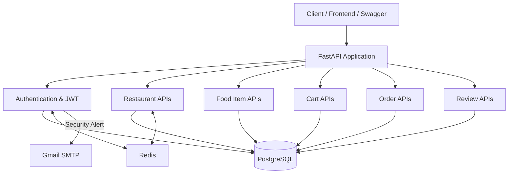
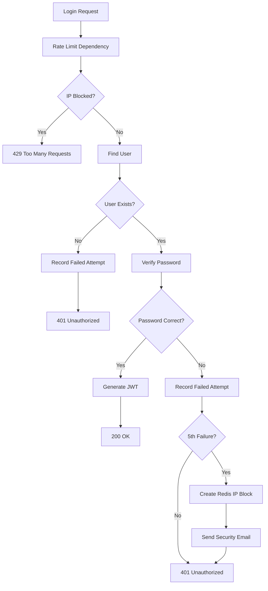
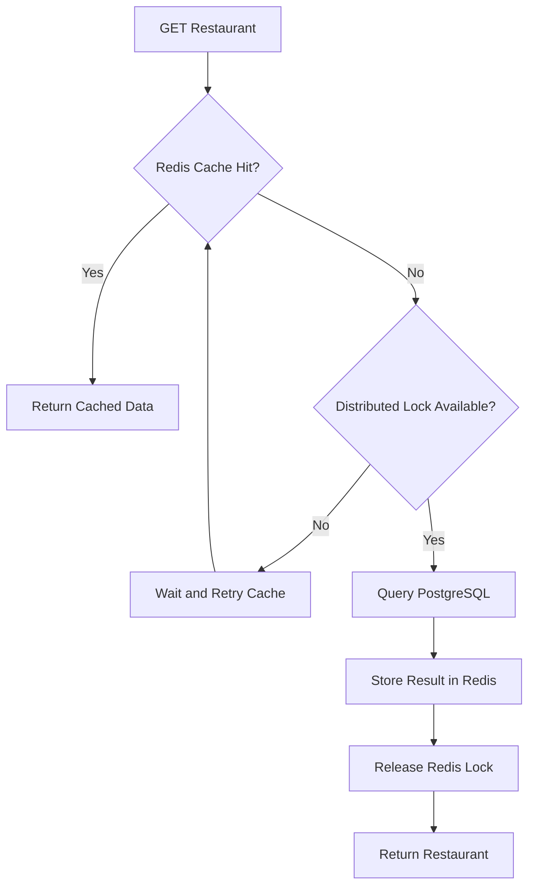
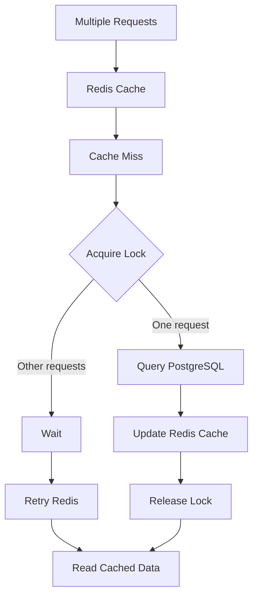
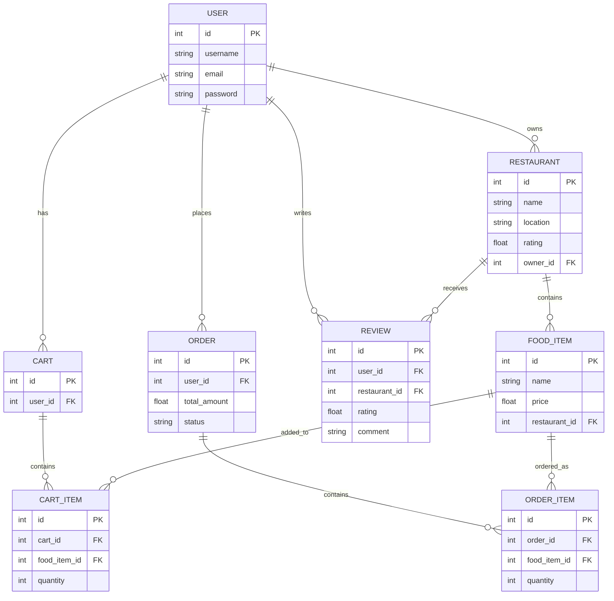
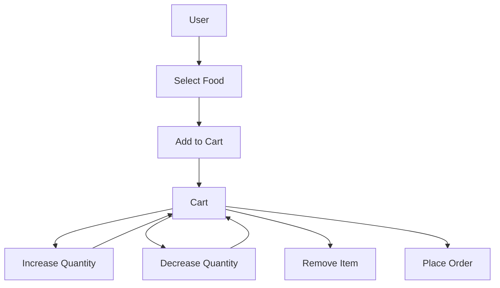
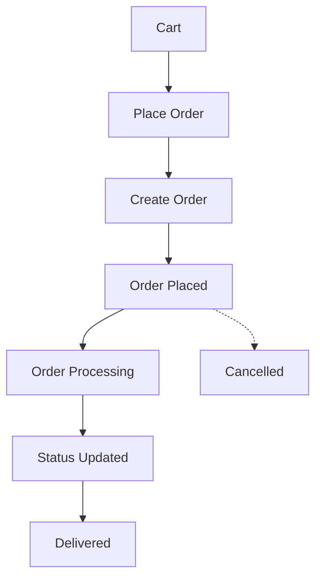
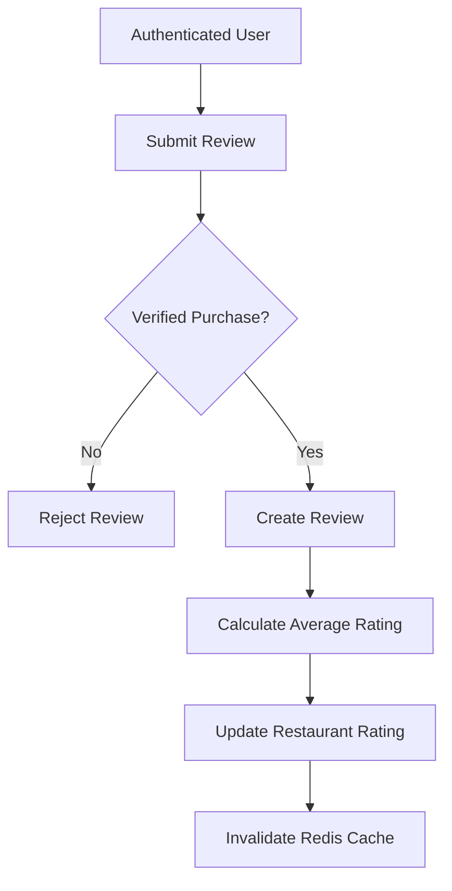
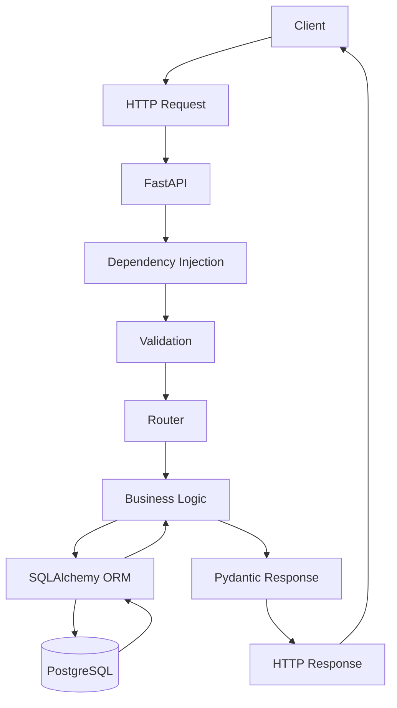

# 🍔 Food Delivery Backend

A production-style REST API backend for a food delivery platform, built with **FastAPI, PostgreSQL, SQLAlchemy and Redis**.

The project focuses on backend engineering concepts such as authentication, authorisation, caching, rate limiting, distributed locking, database relationships, Dockerisation and secure API design.

---

## 🚀 Features

### 👤 Authentication & Security

* User signup and login
* Password hashing with bcrypt
* JWT-based authentication
* Protected API routes
* User authentication and authorisation
* Restaurant ownership validation
* Failed-login rate limiting
* Redis-based sliding-window rate limiter
* IP blocking after repeated failed login attempts
* Security email alerts after repeated failed logins

### 🍽️ Restaurant Management

* Create restaurants
* Get all restaurants
* Get restaurant by ID
* Update restaurant
* Delete restaurant
* Restaurant search
* Restaurant image upload
* Restaurant rating management

### 🍔 Food Items

* Add food items to restaurants
* Get restaurant food items
* Food-item ownership through restaurant relationships

### 🛒 Cart

* Add food items to cart
* View cart
* Increase quantity
* Decrease quantity
* Remove items from cart

### 📦 Orders

* Place orders
* View order history
* Get individual order details
* Update order status
* Order-item relationships

### ⭐ Reviews

* Add restaurant reviews
* Verified-purchase requirement
* Automatic restaurant average-rating update
* Redis cache invalidation after rating changes

### ⚡ Redis

* Restaurant response caching
* TTL-based cache expiration
* Cache invalidation
* Cache-stampede protection
* Redis distributed locking
* Sliding-window rate limiting

### 🐳 Docker

* Dockerised FastAPI application
* PostgreSQL container
* Redis container
* Docker Compose orchestration

### 🧪 Testing

* Pytest-based authentication tests
* API behaviour testing

---

# 🏗️ System Architecture



---

# 🔐 Login Security Flow

The login system uses Redis to track failed authentication attempts by IP address.

Five failed attempts within the sliding window cause the IP to be temporarily blocked.



### Failed-login behaviour

```text
Failure 1 → 401
Failure 2 → 401
Failure 3 → 401
Failure 4 → 401
Failure 5 → 401 + Security Email + IP Block
Next request → 429
```

---

# ⚡ Redis Caching

Frequently requested restaurant data can be served from Redis instead of querying PostgreSQL every time.



### Cache strategy

```text
Request
   ↓
Redis
   ↓
Cache HIT ───────→ Return data
   │
   └── Cache MISS
          ↓
      PostgreSQL
          ↓
       Redis
          ↓
      Return data
```

Redis is used as a **cache and coordination layer**.

PostgreSQL remains the **source of truth**.

---

# 🔒 Distributed Locking

The project uses Redis locks to protect against a cache stampede.

When multiple requests simultaneously miss the same cache:



The lock uses:

* Redis `SET NX`
* Lock TTL
* Unique lock token
* Atomic Lua compare-and-delete for safe unlocking

---

# 🗄️ Database Architecture

The application uses **PostgreSQL** with **SQLAlchemy ORM**.



---

# 🛒 Cart Workflow



---

# 📦 Order Workflow



---

# ⭐ Review Workflow



---

# 🧱 Project Structure

```text
food_delivary_backend/
│
├── application/
│   │
│   ├── auth/
│   │   ├── JWT_Handler.py
│   │   └── rate_limiter.py
│   │
│   ├── models/
│   │   ├── users.py
│   │   ├── restaurants.py
│   │   ├── food_items.py
│   │   ├── cart.py
│   │   ├── orders.py
│   │   └── reviews.py
│   │
│   ├── routes/
│   │   ├── users.py
│   │   ├── restaurants.py
│   │   ├── cart.py
│   │   ├── orders.py
│   │   └── reviews.py
│   │
│   ├── schemas/
│   │
│   ├── services/
│   │   └── email_service.py
│   │
│   ├── database.py
│   ├── redis_client.py
│   ├── logger.py
│   └── main.py
│
├── tests/
│   └── test_auth.py
│
├── Dockerfile
├── docker-compose.yml
├── requirements.txt
├── .env
├── .gitignore
└── README.md
```

> Never commit `.env` or real credentials to GitHub.

---

# 🛠️ Tech Stack

| Technology            | Purpose                            |
| --------------------- | ---------------------------------- |
| **Python**            | Backend programming                |
| **FastAPI**           | REST API framework                 |
| **PostgreSQL**        | Relational database                |
| **SQLAlchemy**        | ORM                                |
| **Pydantic**          | Data validation                    |
| **JWT**               | Authentication                     |
| **bcrypt**            | Password hashing                   |
| **Redis**             | Caching, locking and rate limiting |
| **Docker**            | Containerisation                   |
| **Docker Compose**    | Multi-container orchestration      |
| **Pytest**            | Testing                            |
| **SMTP / Gmail**      | Security email notifications       |
| **Swagger / OpenAPI** | API documentation                  |

---

# 📡 API Reference

## Authentication

| Method | Endpoint       | Description       |
| ------ | -------------- | ----------------- |
| `POST` | `/auth/signup` | Register user     |
| `POST` | `/auth/login`  | Authenticate user |

## Restaurants

| Method   | Endpoint              | Description        |
| -------- | --------------------- | ------------------ |
| `POST`   | `/restaurants`        | Create restaurant  |
| `GET`    | `/restaurants/`       | Get restaurants    |
| `GET`    | `/restaurants/search` | Search restaurants |
| `GET`    | `/restaurants/{id}`   | Get restaurant     |
| `PUT`    | `/restaurants/{id}`   | Update restaurant  |
| `DELETE` | `/restaurants/{id}`   | Delete restaurant  |

## Food Items

| Method | Endpoint                       | Description    |
| ------ | ------------------------------ | -------------- |
| `POST` | `/restaurants/{id}/food-items` | Add food item  |
| `GET`  | `/restaurants/{id}/food-items` | Get food items |

## Cart

| Method   | Endpoint                        | Description       |
| -------- | ------------------------------- | ----------------- |
| `GET`    | `/cart/`                        | Get cart          |
| `POST`   | `/cart/`                        | Add item          |
| `PATCH`  | `/cart/{food_item_id}/increase` | Increase quantity |
| `PATCH`  | `/cart/{food_item_id}/decrease` | Decrease quantity |
| `DELETE` | `/cart/{food_item_id}`          | Remove item       |

## Orders

| Method  | Endpoint                        | Description         |
| ------- | ------------------------------- | ------------------- |
| `POST`  | `/order/`                       | Place order         |
| `GET`   | `/order/`                       | Get order history   |
| `GET`   | `/order/{order_id}`             | Get order           |
| `PATCH` | `/order/{order_id}/status_info` | Update order status |

## Reviews

| Method | Endpoint                    | Description           |
| ------ | --------------------------- | --------------------- |
| `POST` | `/restaurants/{id}/reviews` | Add restaurant review |

---

# 🔄 Backend Request Lifecycle



---

# 🐳 Running with Docker

### 1. Clone the repository

```bash
git clone https://github.com/SathvikHegade/food_delivary_backend.git
cd food_delivary_backend
```

### 2. Configure environment variables

Create a `.env` file with the required configuration.

Example:

```env
POSTGRES_USER=your_user
POSTGRES_PASSWORD=your_password
POSTGRES_DB=food_delivery

DATABASE_URL=your_database_url

SECRET_KEY=your_secret_key

EMAIL_HOST=smtp.gmail.com
EMAIL_PORT=587
EMAIL_USERNAME=your_email
EMAIL_PASSWORD=your_gmail_app_password
```

**Never commit the real `.env` file.**

### 3. Start the application

```bash
docker compose up --build
```

The API will be available at:

```text
http://localhost:8000
```

---

# 📚 API Documentation

Once the application is running:

```text
http://localhost:8000/docs
```

FastAPI provides an interactive Swagger/OpenAPI interface where you can inspect and test the API.

ReDoc is also available at:

```text
http://localhost:8000/redoc
```

---

# 🧪 Testing

Run the test suite with:

```bash
pytest
```

If your environment requires the application directory on `PYTHONPATH`:

### PowerShell

```powershell
$env:PYTHONPATH="application"
pytest -v
```

---

# 🔐 Security Highlights

This project implements several backend security mechanisms:

* Password hashing
* JWT authentication
* Authentication dependencies
* Ownership-based authorisation
* Failed-login rate limiting
* Redis-based IP blocking
* Security email alerts
* Environment-variable based secrets
* Verified-purchase reviews
* Database-backed user validation

---

# ⚡ Backend Engineering Concepts Demonstrated

This project goes beyond basic CRUD and demonstrates:

* REST API design
* FastAPI dependency injection
* JWT authentication
* Password hashing
* SQLAlchemy ORM
* PostgreSQL
* Redis caching
* Cache invalidation
* Cache stampede protection
* Distributed locks
* Redis Lua scripts
* Sliding-window rate limiting
* TTL-based expiration
* IP-based protection
* Database relationships
* Docker and Docker Compose
* API validation
* Logging
* Automated testing
* SMTP email notifications
* Authentication vs authorisation

---

# 🎯 Project Goal

The goal of this project is to build a realistic backend while learning how production-oriented backend systems handle:

```text
Authentication
      ↓
Authorisation
      ↓
Database Operations
      ↓
Caching
      ↓
Concurrency
      ↓
Rate Limiting
      ↓
Security Monitoring
      ↓
Containerisation
```

---

# 👨‍💻 Author

**T S Sathvik Hegade**

Computer Science Engineering Student

[GitHub](https://github.com/SathvikHegade)

---

## 📄 License

This project is licensed under the **MIT License**.
