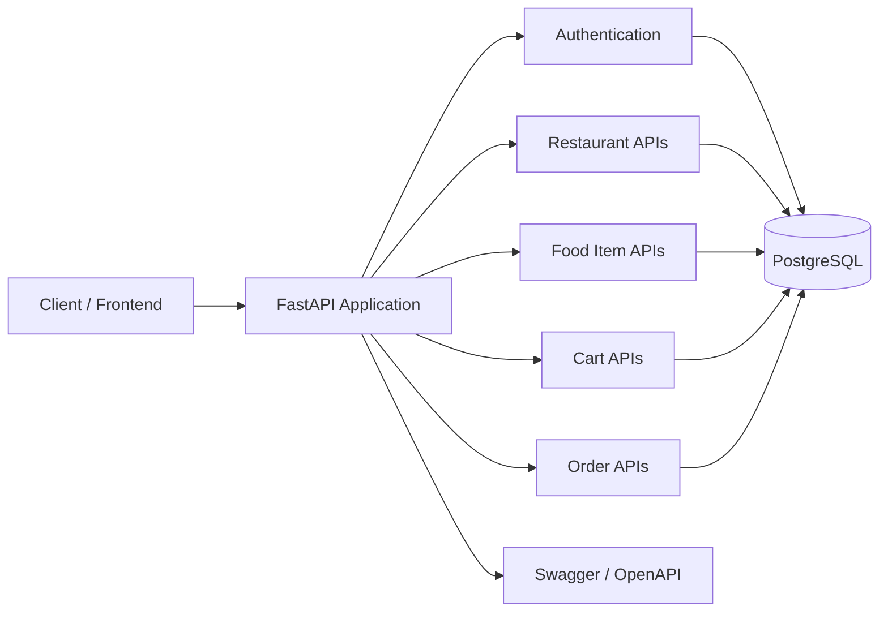
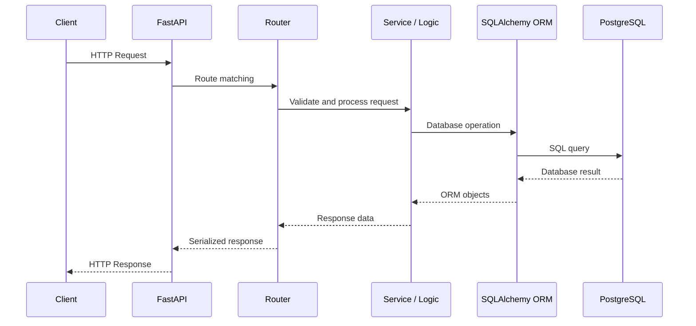
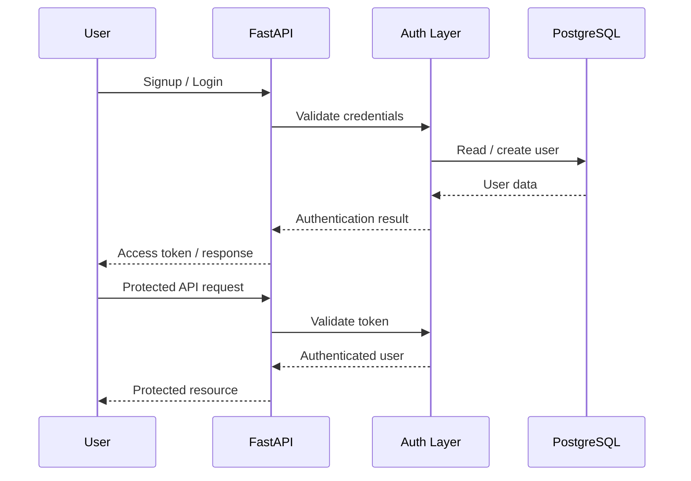
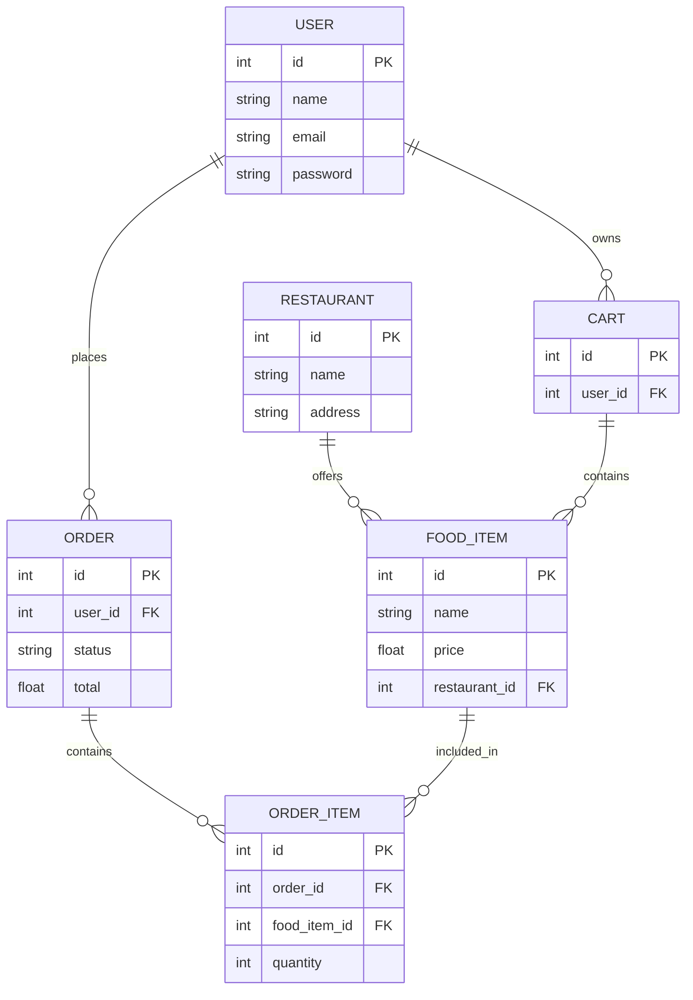
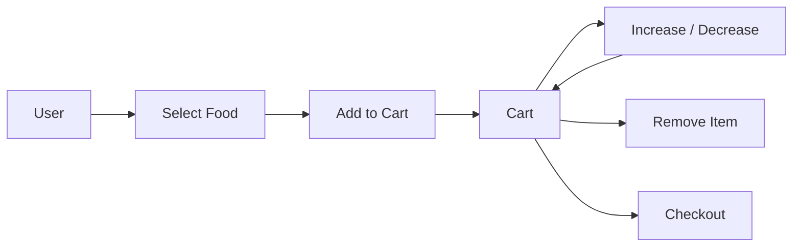
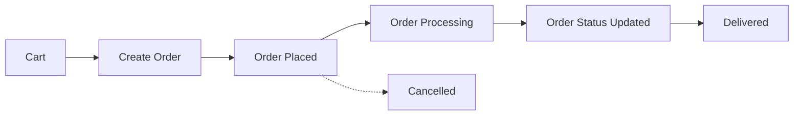
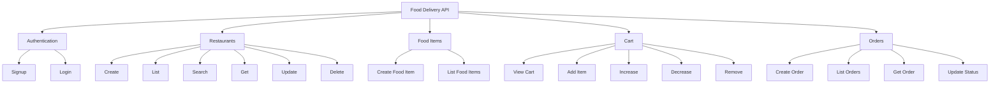

# 🍔 Food Delivery Backend

A production-style REST API backend for a food-delivery platform, built with **FastAPI**.

> **Repository:** `food_delivary_backend`

## ✨ What this project demonstrates

- RESTful API design with FastAPI
- User authentication and authorization
- Restaurant management
- Food-item management
- Cart operations
- Order creation and management
- PostgreSQL database integration
- SQLAlchemy ORM
- Pydantic schemas
- Docker-based development
- Interactive API documentation
- Clean backend layering

---

## 🏗️ System Architecture



### 🔎 Interactive architecture

For **Zoom In, Zoom Out, Pan Left/Right, Pan Up/Down, Reset and Full Screen**, open:

**[Open Interactive Architecture Viewer](./docs/architecture.html)**

GitHub renders Mermaid diagrams natively, but does not allow JavaScript controls inside `README.md`. The separate viewer provides the interactive controls.

---

# 🔄 API Request Flow



**Interactive version:** [Open API Request Flow Viewer](./docs/request-flow.html)

---

# 🔐 Authentication Flow



**Interactive version:** [Open Authentication Flow Viewer](./docs/auth-flow.html)

---

# 🗃️ Database / ER Diagram



**Interactive version:** [Open ER Diagram Viewer](./docs/er-diagram.html)

---

# 🛒 Cart Workflow



**Interactive version:** [Open Cart Workflow Viewer](./docs/cart-flow.html)

---

# 📦 Order Workflow



**Interactive version:** [Open Order Workflow Viewer](./docs/order-flow.html)

---

# 🧭 API Domain Map



**Interactive version:** [Open API Map Viewer](./docs/api-map.html)

---

# 📡 API Reference

## Authentication

| Method | Endpoint | Purpose |
|---|---|---|
| POST | `/auth/signup` | Register a user |
| POST | `/auth/login` | Authenticate a user |

## Restaurants

| Method | Endpoint | Purpose |
|---|---|---|
| POST | `/restaurants` | Create restaurant |
| GET | `/restaurants/` | List restaurants |
| GET | `/restaurants/search` | Search restaurants |
| GET | `/restaurants/{id}` | Get restaurant |
| PUT | `/restaurants/{id}` | Update restaurant |
| DELETE | `/restaurants/{id}` | Delete restaurant |
| PATCH | `/restaurants/{id}/image` | Update restaurant image |

## Food Items

| Method | Endpoint | Purpose |
|---|---|---|
| POST | `/restaurants/{id}/food-items` | Create food item |
| GET | `/restaurants/{id}/food-items` | List restaurant food items |

## Cart

| Method | Endpoint | Purpose |
|---|---|---|
| POST | `/cart/` | Add item to cart |
| GET | `/cart/` | Get cart |
| PATCH | `/cart/{food_item_id}/increase` | Increase quantity |
| PATCH | `/cart/{food_item_id}/decrease` | Decrease quantity |
| DELETE | `/cart/{food_item_id}` | Remove item |

## Orders

| Method | Endpoint | Purpose |
|---|---|---|
| POST | `/order/` | Create order |
| GET | `/order/` | List orders |
| GET | `/order/{order_id}` | Get order |
| PATCH | `/order/{order_id}/status_info` | Update order status |

---

# 📁 Project Structure

```text
food_delivary_backend/
│
├── app/
│   ├── routers/
│   ├── models/
│   ├── schemas/
│   ├── services/
│   ├── database/
│   └── main.py
│
├── tests/
│
├── docs/
│   ├── architecture.html
│   ├── request-flow.html
│   ├── auth-flow.html
│   ├── er-diagram.html
│   ├── cart-flow.html
│   ├── order-flow.html
│   └── api-map.html
│
├── Dockerfile
├── docker-compose.yml
├── requirements.txt
└── README.md
```

---

# 🚀 Running the Project

## 1. Clone

```bash
git clone https://github.com/SathvikHegade/food_delivary_backend.git
cd food_delivary_backend
```

## 2. Create virtual environment

```bash
python -m venv venv
```

### Windows

```powershell
venv\Scripts\activate
```

## 3. Install dependencies

```bash
pip install -r requirements.txt
```

## 4. Configure environment variables

Create a `.env` file containing the database and authentication configuration required by the project.

## 5. Start the application

```bash
uvicorn app.main:app --reload
```

---

# 📚 API Documentation

Once the application is running:

- Swagger UI: `/docs`
- ReDoc: `/redoc`

These interfaces make it easy to inspect endpoints and test API requests.

---

# 🐳 Docker

The project also contains Docker configuration for running the backend in a containerized environment.

Typical workflow:

```bash
docker compose up --build
```

---

# 🧪 Testing

Run the project's test suite with:

```bash
pytest
```

---

# 🧠 Backend Request Lifecycle

```text
Client
  │
  ▼
HTTP Request
  │
  ▼
FastAPI Router
  │
  ▼
Validation
  │
  ▼
Business Logic
  │
  ▼
SQLAlchemy ORM
  │
  ▼
PostgreSQL
  │
  ▼
Database Result
  │
  ▼
Pydantic Serialization
  │
  ▼
HTTP Response
  │
  ▼
Client
```

---

# 🎯 Interview Value

This project gives you practical talking points around:

- REST API architecture
- FastAPI routing
- Authentication
- Dependency injection
- ORM and relational databases
- Data validation
- CRUD operations
- Cart and order workflows
- Docker
- API documentation
- Database relationships
- Backend request lifecycle

---

# 🗺️ Interactive Diagram Gallery

| Diagram | Interactive Viewer |
|---|---|
| System Architecture | [Open](./docs/architecture.html) |
| API Request Flow | [Open](./docs/request-flow.html) |
| Authentication | [Open](./docs/auth-flow.html) |
| ER Diagram | [Open](./docs/er-diagram.html) |
| Cart Workflow | [Open](./docs/cart-flow.html) |
| Order Workflow | [Open](./docs/order-flow.html) |
| API Domain Map | [Open](./docs/api-map.html) |

---

## ⚠️ Important

The `README.md` is designed to render directly on GitHub using Mermaid.

The interactive HTML diagrams provide the additional controls that GitHub Markdown itself cannot provide:

**Zoom In · Zoom Out · Pan · Reset · Full Screen**

---

## 👨‍💻 Author

**Sathvik Hegade**

GitHub: `https://github.com/SathvikHegade`
