# 🍔 Food Delivery Backend

A production-oriented REST API backend for a food delivery platform built with **FastAPI, PostgreSQL, SQLAlchemy and Redis**.

The project has evolved from a basic REST API into a backend with **JWT authentication, authorisation, Redis caching, cache-stampede protection, distributed locking, sliding-window rate limiting, IP blocking, security email alerts, Dockerisation and automated testing**.

---

## 🚀 Features

### 👤 Authentication & Security
- User registration and login
- JWT-based authentication
- bcrypt password hashing
- Authentication and authorisation
- Restaurant ownership validation
- Sliding-window failed-login rate limiting
- Temporary IP blocking
- Security email alerts

### 🍽️ Core Features
- Restaurant CRUD and search
- Food-item management
- Cart management
- Order management
- Order history and status updates
- Verified-purchase restaurant reviews
- Automatic restaurant rating updates

### ⚡ Redis & Performance
- Restaurant response caching
- TTL-based expiration
- Cache invalidation
- Cache-stampede protection
- Distributed Redis locking
- Atomic Redis Lua operations

### 🐳 Infrastructure & Testing
- Docker + Docker Compose
- PostgreSQL container
- Redis container
- Pytest authentication tests
- Swagger / OpenAPI documentation

---

# 🏗️ System Architecture

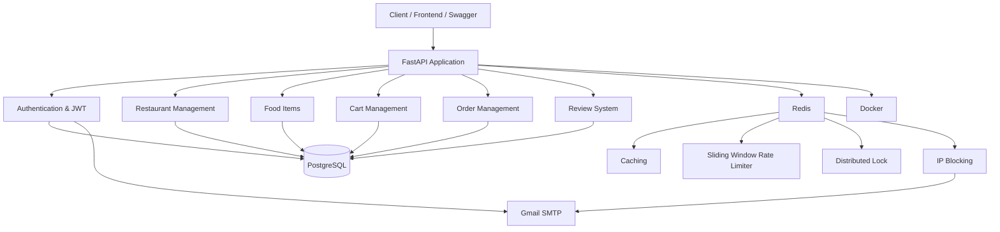

---

# 📈 Backend Development Evolution

```mermaid
flowchart LR
    A["Basic REST API"]
    --> B["PostgreSQL + SQLAlchemy"]
    --> C["JWT Authentication"]
    --> D["Authorisation & Ownership"]
    --> E["Cart & Order System"]
    --> F["Review System"]
    --> G["Redis Integration"]
    --> H["Redis Caching"]
    --> I["Cache Invalidation"]
    --> J["Cache Stampede Protection"]
    --> K["Distributed Redis Lock"]
    --> L["Sliding Window Rate Limiter"]
    --> M["IP Blocking"]
    --> N["Security Email Alerts"]
    --> O["Dockerisation"]
    --> P["Automated Testing"]
```

---

# 🔐 Login Security

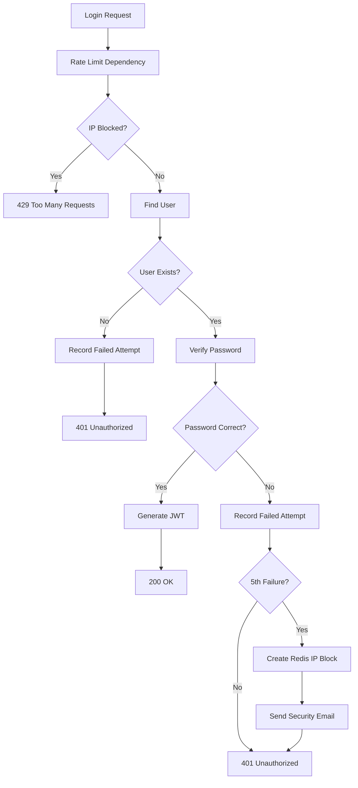

### Login behaviour

```text
Failed attempt #1 → 401
Failed attempt #2 → 401
Failed attempt #3 → 401
Failed attempt #4 → 401
Failed attempt #5 → 401 + IP Block + Security Email
Next attempt       → 429
```

---

# ⚡ Redis Caching

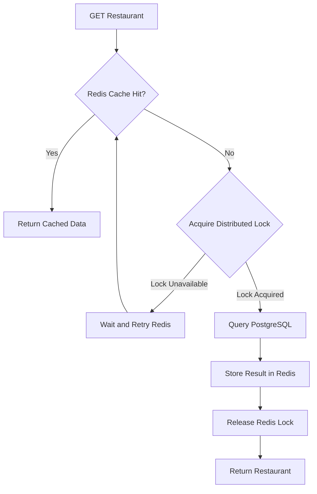

PostgreSQL remains the **source of truth**, while Redis acts as a fast cache and coordination layer.

---

# 🔒 Cache Stampede Protection

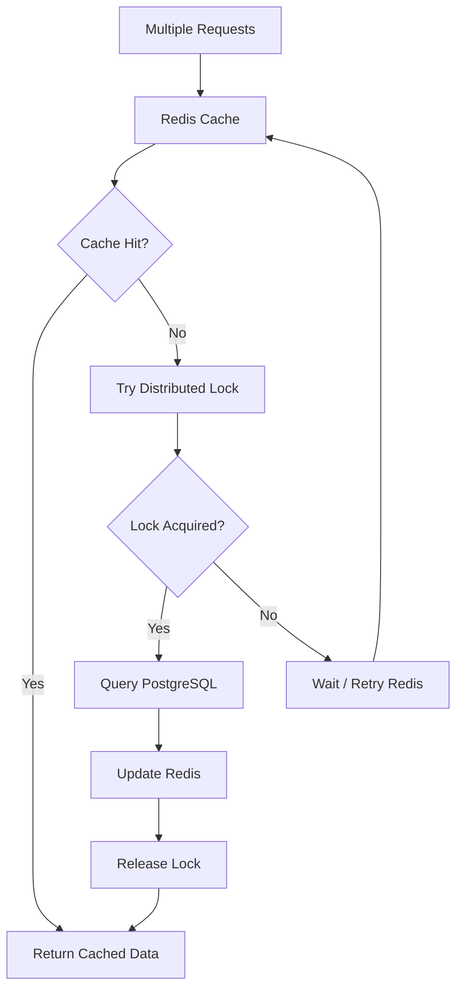

Redis distributed locks prevent many concurrent requests from rebuilding the same expired cache entry.

Implementation concepts:
- `SET NX`
- Lock TTL
- Unique lock tokens
- Atomic Lua compare-and-delete

---

# 🚦 Rate Limiting

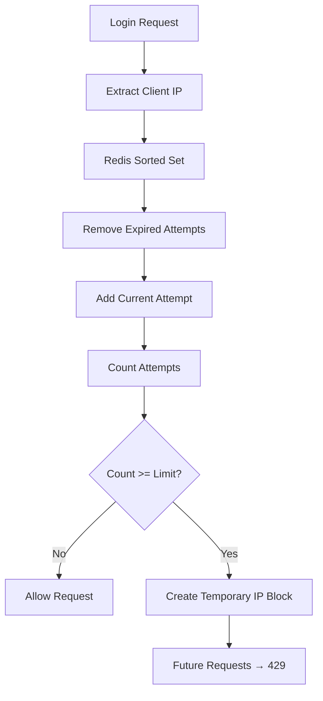

The rate limiter uses a **Redis Sorted Set** and an **atomic Lua script** to perform the sliding-window operation safely under concurrent requests.

---

# 📧 Security Email Alerts

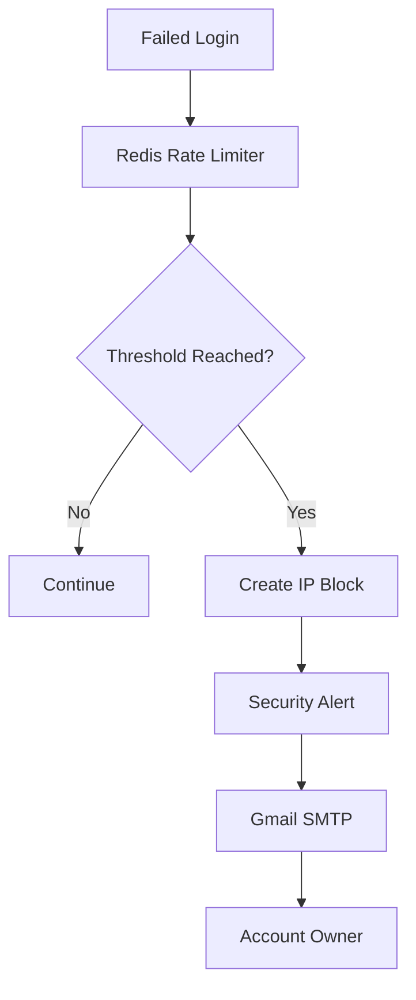

The email is a **notification**, while Redis rate limiting and IP blocking provide the actual protection.

---

# 🗄️ Database Architecture

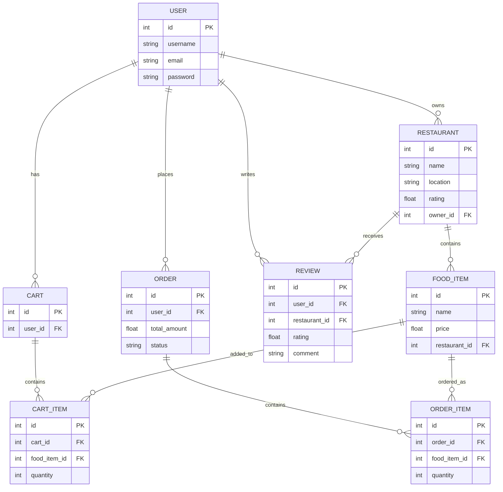

---

# ⭐ Review System

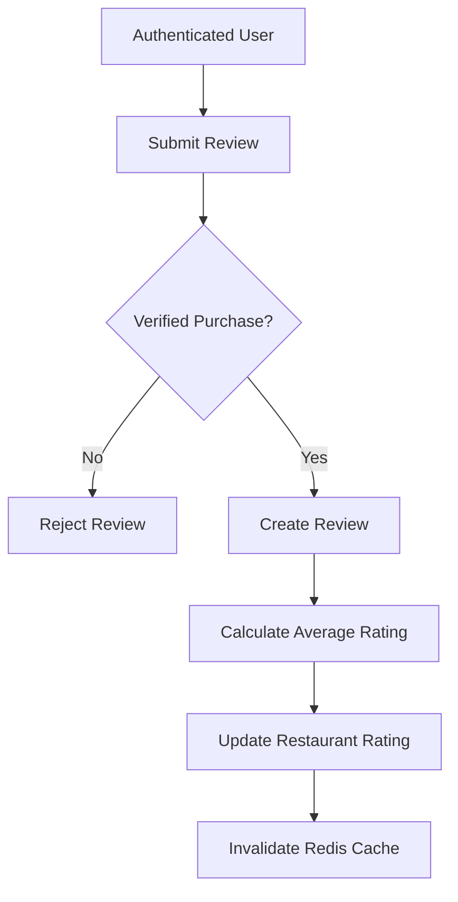

---

# 📦 Order Flow

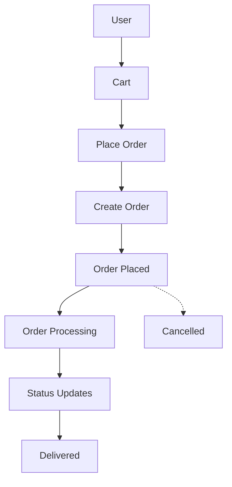

---

# 🔄 Request Lifecycle

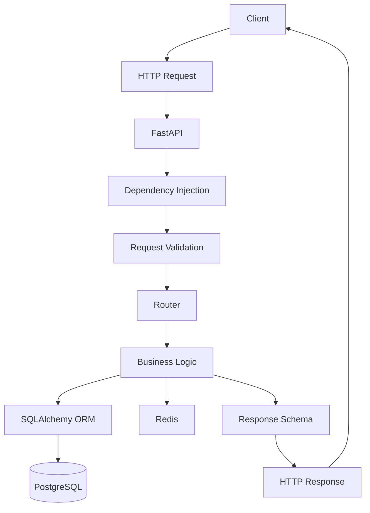

---

# 🐳 Docker Architecture

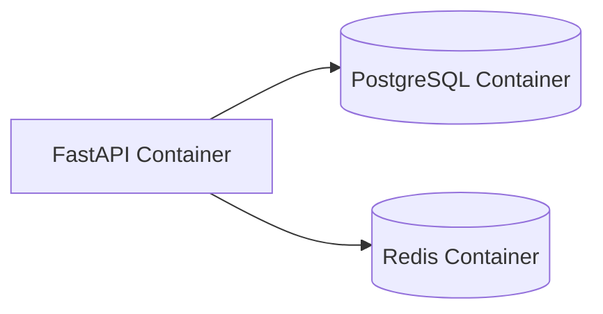

Start the complete application with:

```bash
docker compose up --build
```

---

# 🧱 Project Structure

```text
food_delivary_backend/
│
├── application/
│   ├── auth/
│   │   ├── JWT_Handler.py
│   │   └── rate_limiter.py
│   │
│   ├── models/
│   ├── routes/
│   ├── schemas/
│   ├── services/
│   │   └── email_service.py
│   │
│   ├── database.py
│   ├── redis_client.py
│   ├── logger.py
│   └── main.py
│
├── tests/
│   └── test_auth.py
│
├── Dockerfile
├── docker-compose.yml
├── requirements.txt
├── .gitignore
└── README.md
```

---

# 🛠️ Tech Stack

| Technology | Purpose |
|---|---|
| Python | Backend |
| FastAPI | REST API |
| PostgreSQL | Database |
| SQLAlchemy | ORM |
| Pydantic | Validation |
| Redis | Cache, locking & rate limiting |
| JWT | Authentication |
| bcrypt | Password hashing |
| Docker | Containerisation |
| Docker Compose | Orchestration |
| Pytest | Testing |
| SMTP / Gmail | Security alerts |
| Swagger / OpenAPI | API documentation |

---

# 📡 API Overview

### Authentication

| Method | Endpoint | Description |
|---|---|---|
| POST | `/auth/signup` | Register user |
| POST | `/auth/login` | Login |

### Restaurants

| Method | Endpoint | Description |
|---|---|---|
| POST | `/restaurants` | Create restaurant |
| GET | `/restaurants/` | List restaurants |
| GET | `/restaurants/{id}` | Get restaurant |
| PUT | `/restaurants/{id}` | Update restaurant |
| DELETE | `/restaurants/{id}` | Delete restaurant |

### Food Items

| Method | Endpoint | Description |
|---|---|---|
| POST | `/restaurants/{id}/food-items` | Add food item |
| GET | `/restaurants/{id}/food-items` | Get food items |

### Cart

| Method | Endpoint | Description |
|---|---|---|
| GET | `/cart/` | Get cart |
| POST | `/cart/` | Add item |
| PATCH | `/cart/{id}/increase` | Increase quantity |
| PATCH | `/cart/{id}/decrease` | Decrease quantity |
| DELETE | `/cart/{id}` | Remove item |

### Orders

| Method | Endpoint | Description |
|---|---|---|
| POST | `/order/` | Place order |
| GET | `/order/` | Order history |
| GET | `/order/{id}` | Order details |

### Reviews

| Method | Endpoint | Description |
|---|---|---|
| POST | `/restaurants/{id}/reviews` | Add review |

For complete interactive API documentation, use Swagger.

---

# 🚀 Getting Started

### 1. Clone

```bash
git clone https://github.com/SathvikHegade/food_delivary_backend.git
cd food_delivary_backend
```

### 2. Configure environment variables

Create a `.env` file:

```env
POSTGRES_USER=your_user
POSTGRES_PASSWORD=your_password
POSTGRES_DB=food_delivery

DATABASE_URL=your_database_url
SECRET_KEY=your_secret_key

EMAIL_HOST=smtp.gmail.com
EMAIL_PORT=587
EMAIL_USERNAME=your_email
EMAIL_PASSWORD=your_gmail_app_password
```

> ⚠️ Never commit real credentials or `.env` to GitHub.

### 3. Start

```bash
docker compose up --build
```

Application:

```text
http://localhost:8000
```

Swagger:

```text
http://localhost:8000/docs
```

ReDoc:

```text
http://localhost:8000/redoc
```

---

# 🧪 Testing

Run:

```bash
pytest -v
```

PowerShell, if required:

```powershell
$env:PYTHONPATH="application"
pytest -v
```

---

# 🔐 Security Highlights

- JWT authentication
- bcrypt password hashing
- Dependency-based authentication
- Ownership-based authorisation
- Redis sliding-window rate limiting
- Atomic Redis Lua operations
- Temporary IP blocking
- Distributed Redis locks
- Cache-stampede protection
- Security email notifications
- Environment-based secrets
- Verified-purchase reviews

---

# 📚 Backend Concepts Demonstrated

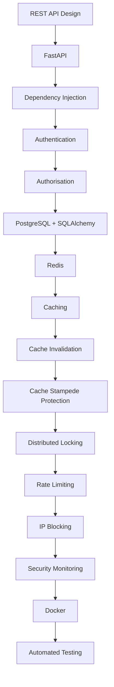

---

# 👨‍💻 Author

**T S Sathvik Hegade**

Computer Science Engineering Student

[GitHub](https://github.com/SathvikHegade)

---

## 📄 License

This project is licensed under the MIT License.
